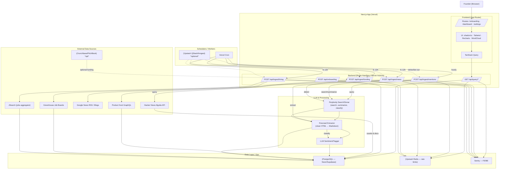
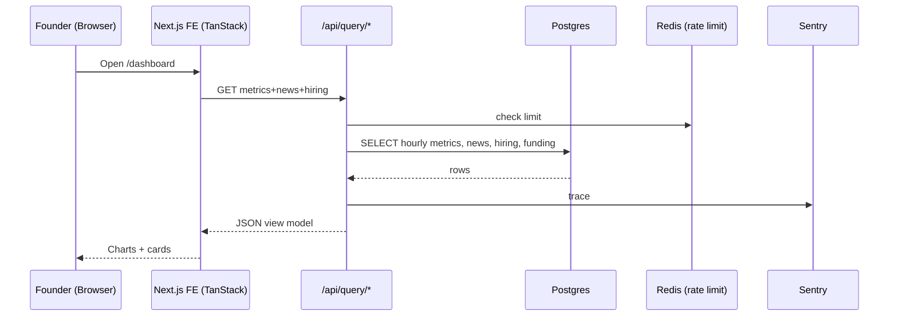
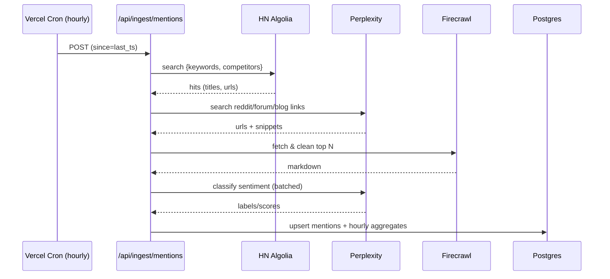

Awesome idea. Here’s a tight, execution-ready plan for an MVP you can ship during the hackathon, built on **Next.js** and Perplexity’s APIs, with tasks split for a 4-person team.

# Kill My Startup — MVP plan (Next.js)

## 1) Value prop (MVP)
A founder-facing dashboard that **self-updates every 6–12h** to show:
- Funding + launches for selected competitors
- Conversation volume + sentiment + word cloud
- Top recent news (LLM-summarized with citations)
- Hiring signals
- (Stretch) revenue proxies (confidence-scored)

All aggregation is grounded by **Perplexity Search/Sonar** plus a small set of public/official APIs to keep it stable for demo. citeturn0search0turn1search10turn1search6

---

## 2) High-level architecture

**Frontend (Next.js App Router)**
- Pages: `/onboarding`, `/dashboard`, `/settings`
- Components: Sparkline, WordCloud, Timelines, “Top news” cards (with sources), Hiring list
- State/data fetching with **TanStack Query**; UI with **Tailwind + shadcn/ui**; charts with **Recharts**

**Backend (Next.js Route Handlers / Server Actions)**
- `/api/ingest/*` (scheduled jobs; idempotent)
- `/api/query/*` (dashboard reads)

**Schedulers / Workers**
- **Vercel Cron** or **Upstash QStash / Inngest** for reliable 1h and 6–12h jobs. Vercel Cron is simplest; add QStash/Inngest if you want retries/fan-out. citeturn0search1turn0search8turn6search1turn6search0

**Data layer**
- **PostgreSQL** (Neon/Supabase) via **Prisma**
- Tables (minimal):
  - `project(id, name, keywords[])`
  - `competitor(id, name, domain, sources, active)`
  - `news_item(id, url, title, published_at, source, summary, citations, project_id, competitor_id)`
  - `mention(id, source, url, published_at, text, project_id, competitor_id, sentiment_score)`
  - `metric_hourly(id, kind, ts_hour, value, project_id, competitor_id)`  // volume, pos/neg counts
  - `funding_round(id, competitor_id, announced_on, amount, round_type, source)`
  - `milestone(id, competitor_id, happened_on, type, title, url)`
  - `hiring_signal(id, company, role, seniority, url, posted_at, source)`
  - (stretch) `revenue_estimate(id, competitor_id, month, value, method, confidence)`

**Observability & ops**
- **Sentry** for FE/BE, **Rate limiting** with Upstash Redis, **Secrets** in Vercel Env.

---

## 3) Data sources (hackathon-friendly, ToS-aware) & how we’ll use them

- **Perplexity Search/Sonar** (primary aggregation & summarization). Use Search API to find fresh links by query (“{competitor} funding”, “{space} market”, “product launch …”), then Sonar (Pro) to summarize with citations and classify sentiment/labels. Official SDKs exist for TS/Node. citeturn0search0turn1search1turn1search9  
- **Hacker News (Algolia API)** for conversation volume / comments—free & generous limits; easy hourly counts. citeturn0search2  
- **Product Hunt API (GraphQL)** for “Competitors launched / milestones”. citeturn0search3  
- **Google News RSS** for additional “Top recent news” (use RSS search feeds as a fallback stream). citeturn4search16  
- **Hiring signals**:
  - **Greenhouse Job Board API** (public company boards) + **JSearch** (Google-for-Jobs aggregator) for breadth during demo. citeturn7search2turn7search1  
- **Funding**:
  - If you have **Crunchbase/PitchBook** access, use their official APIs; otherwise, get links via Perplexity + **Firecrawl** to extract article/press-release details (amount/date) and store as structured `funding_round`. citeturn3search12turn3search1turn1search2  
- **Socials caveat**: **X/Twitter & Reddit** now have pricing/permissions that make direct ingestion tricky for hackathon budgets; plan to rely on Perplexity-discovered links to posts or public mirrors, plus HN/Reddit via news sites’ coverage. If you do integrate, expect paid tiers and OAuth. citeturn0search12turn0search19turn2search18

---

## 4) Pipelines & schedules

**Every hour (volume/sentiment):**
1) `mentions:collect`:  
   - HN Algolia search for each keyword/competitor; count hits & pull recent titles/snippets.  
   - Perplexity Search for “{keyword} reddit OR forum OR blog OR review”—store URLs (no heavy scrape yet). citeturn0search2turn0search0
2) `mentions:enrich`:  
   - Fetch top N new URLs with **Firecrawl** (markdown extraction).  
   - Light heuristic clean; **LLM classify** (positive/negative/neutral + reasons) via Sonar; store `mention` + `sentiment_score`. citeturn1search2
3) `metrics:aggregate`: roll up hourly counts into `metric_hourly` (volume, pos, neg).

**Every 6–12 hours (news, funding, launches):**
1) `news:pull`: Perplexity Search by project/competitor; dedupe by URL; **Sonar** summarize to 3–5 bullet cards with citations. citeturn0search0  
2) `funding:detect`: Queries like “{competitor} raises” + “funding round”, plus Product Hunt/PH posts; extract `{amount, date, round_type}` (LLM-assisted parsing of crawled text); write `funding_round`. citeturn0search3  
3) `launches:timeline`: Product Hunt GraphQL for launches + milestones; merge with news-derived milestones. citeturn0search3  
4) `hiring:scan`: Greenhouse boards for the space; JSearch for key titles (e.g., “VP Sales”, “Head of ML”). Store `hiring_signal`. citeturn7search2turn7search1

**Daily (stretch – revenue proxies):**
- Use news/press and Similarweb/Clearbit (if keys) to create **confidence-scored monthly proxies**: e.g., “MRR mentioned in article”, “traffic change + pricing page anchor”, “headcount trend + roles mix”. (Mark clearly as “estimate”.) citeturn5search0turn5search1

**Schedulers**
- Start with **Vercel Cron** for `*/60min` and `*/6h` jobs. If you want robust retries & fan-out, switch to **Upstash QStash** or **Inngest** wrappers calling your Next.js handlers. citeturn0search1turn6search1turn6search0

---

## 5) Frontend UX (what we’ll demo)

- **Header**: Project selector (your idea), competitor chips (editable)  
- **General Info**: “In the last 7 days: $X raised across Y competitors” (+ list)  
- **People talking**:
  - Sparkline (hourly count) for project vs each competitor (toggle)  
  - Beside each sparkline: **word cloud** from last 24–48h (positive/negative masks)  
- **Competitors launched**: Timeline with launch + milestones (funding, features, partnerships)  
- **Top recent news**: Cards with Sonar summaries + source logos + citation chips  
- **Hiring signals**: Table (company, role, seniority, posted_at, link)

---

## 6) Packages & services

**Core**
- `next` (App Router), `@tanstack/react-query`, `zod`, `date-fns`
- UI: `tailwindcss`, `@/components/ui` (shadcn), `recharts`, `react-wordcloud` (d3-cloud), `lucide-react`
- Data: `prisma`, `@neondatabase/serverless` or `@supabase/*`
- Jobs: **pick one** → `@vercel/cron` (config in `vercel.json`) or `@upstash/qstash` or `inngest`  
- LLM/Search: `@perplexity-ai/perplexity_ai` **or** `@ai-sdk/perplexity` (AI SDK provider) citeturn1search7turn1search4
- Crawling: `@mendable/firecrawl-js` (Node SDK) citeturn1search14
- Auth: `next-auth` (GitHub/Google)
- Ops: `sentry/nextjs`, `@upstash/redis` (rate limits)

---

## 7) API surface (thin)
- `POST /api/onboarding`  → save project, seed competitor list from names/domains  
- `GET /api/dashboard?projectId=...` → returns stitched view model (hourly metrics, news, hiring, timelines)  
- Scheduled only:
  - `POST /api/ingest/mentions`
  - `POST /api/ingest/news`
  - `POST /api/ingest/hiring`
  - `POST /api/ingest/funding`

All scheduled endpoints are idempotent and **accept `since`** to support backfills.

---

## 8) Data model (quick sketch)

- **Entities**: `project` ↔ `competitor` (M:N via `project_competitor`)  
- **Streams**: `news_item`, `mention`, `hiring_signal`, `funding_round`, `milestone`  
- **Metrics**: `metric_hourly(kind, ts_hour, value, project_id, competitor_id)`  
- **Derived**: views for “sparkline”, “word cloud tokens”, “timeline items”.

---

## 9) Work split (4 people, parallel)

**A) FE Lead (Next.js/UX)**
- Scaffold pages + shadcn layout, loading states  
- Sparkline/word cloud/timeline components  
- Dashboard data hooks (TanStack Query)

**B) Data Integrations**
- HN Algolia client + counters; Product Hunt GraphQL; Greenhouse Job Board + JSearch; dedupe & mapping  
- Firecrawl wrapper (rate-aware), content extraction

**C) LLM & Summarization**
- Perplexity Search queries (per project/competitor)  
- Sonar summarize (with citations), sentiment classifier, token-aware batching  
- Word cloud tokenization + stopword handling

**D) Platform/Infra**
- Prisma schema + migrations; Vercel Cron (or QStash/Inngest)  
- Secrets, rate limiting, Sentry  
- Seed script + demo project config

---

## 10) Risk & compliance (and hackathon-friendly choices)

- **Twitter/X & Reddit**: direct API access is paid/permissioned; for MVP rely on Perplexity-discovered public links + HN/PH/news to avoid blockers; add direct integrations only if you have keys/budget. citeturn0search12turn0search19turn2search18  
- **Crunchbase/PitchBook**: official APIs require contracts; for demo, get funding from news/PR via Perplexity + Firecrawl; later, switch to official endpoints. citeturn3search12turn3search1  
- **Scheduling reliability**: Vercel Cron is fine for demo; if you need retries/fan-out, add QStash or Inngest. citeturn0search1turn6search1turn6search0

---

## 11) Milestones (hackathon-paced)

**T+4h**
- Next.js shell + Auth + Prisma schema; seed 3–5 competitors
- HN volume → sparkline; Perplexity Search → one “Top news” card with citations

**T+12h**
- Firecrawl extraction + Sonar summarization for 5–10 links, stored in `news_item`
- Word cloud + sentiment for project stream
- Product Hunt launch timeline populated

**T+24h**
- Hiring signals (Greenhouse + JSearch)  
- “Funding rounds” parsed from PR/news (amount/date) → timeline overlay
- Vercel Cron running hourly & 6h jobs; Sentry wired

**T+36–48h**
- Polish: filters, toggles, empty states; per-competitor comparisons  
- Demo script + sample projects preloaded

---

## 12) “Revenue monitoring” (MVP framing)
Show a **confidence-scored estimate** per competitor/month with a tooltip explaining the method: “Press-reported MRR (high confidence)” vs “Traffic × price proxy (low/med)”. Wire Similarweb/Clearbit only if you have keys; otherwise mark as “coming soon” with the framework implemented. citeturn5search0turn5search1

---

## 13) What you’ll need (env & dependencies)

- `PERPLEXITY_API_KEY` (Search/Sonar) citeturn1search10
- (Optional) `FIRECRAWL_API_KEY` citeturn1search2
- `HNSearch` (no key needed) citeturn0search2
- (Optional) `PRODUCT_HUNT_TOKEN`, `JSEARCH_KEY`, `GREENHOUSE_BOARD_URL`

---

### Final notes
- Keep **all** ingestion idempotent (hash the URL + published_at).  
- Stamp source + citation on every card.  
- Label anything modeled/estimated with confidence.

### Architecture diagram
Here you go—drop this into any Mermaid-enabled doc.



**Dashboard read path**



**Hourly mentions job**




Absolutely — here’s a production-lean Prisma schema plus **example Next.js App Router route handlers** (typed, idempotent-friendly). Copy/paste into your repo and adjust stubs for your data providers.

---

# 1) `prisma/schema.prisma`

```prisma
// prisma/schema.prisma
generator client {
  provider = "prisma-client-js"
}

datasource db {
  provider = "postgresql"
  url      = env("DATABASE_URL")
}

enum SourceType {
  HN
  PRODUCT_HUNT
  GOOGLE_NEWS
  BLOG
  PRESS_RELEASE
  GREENHOUSE
  JSEARCH
  PERPLEXITY
  TWITTER
  REDDIT
  FORUM
  LINKEDIN
  OTHER
}

enum MetricKind {
  MENTION_VOLUME
  SENTIMENT_POS
  SENTIMENT_NEG
}

enum Sentiment {
  POSITIVE
  NEGATIVE
  NEUTRAL
}

enum MilestoneType {
  LAUNCH
  FUNDING
  FEATURE
  PARTNERSHIP
  HIRING
  OTHER
}

enum Seniority {
  INTERN
  JUNIOR
  MID
  SENIOR
  LEAD
  HEAD
  DIRECTOR
  VP
  C_LEVEL
  RESEARCHER
  OTHER
}

model Project {
  id         String        @id @default(cuid())
  name       String
  description String?
  keywords   String[]      @db.Text[]
  createdAt  DateTime      @default(now())
  updatedAt  DateTime      @updatedAt

  competitors ProjectCompetitor[]
  newsItems   NewsItem[]
  mentions    Mention[]
  hiring      HiringSignal[]
  metrics     MetricHourly[]
}

model Competitor {
  id         String        @id @default(cuid())
  name       String
  domain     String?
  active     Boolean       @default(true)
  createdAt  DateTime      @default(now())
  updatedAt  DateTime      @updatedAt

  projects   ProjectCompetitor[]
  newsItems  NewsItem[]
  mentions   Mention[]
  hiring     HiringSignal[]
  metrics    MetricHourly[]
  funding    FundingRound[]
  milestones Milestone[]
  revenue    RevenueEstimate[]
}

model ProjectCompetitor {
  id           String     @id @default(cuid())
  projectId    String
  competitorId String

  project      Project    @relation(fields: [projectId], references: [id], onDelete: Cascade)
  competitor   Competitor @relation(fields: [competitorId], references: [id], onDelete: Cascade)

  @@unique([projectId, competitorId])
  @@index([competitorId])
}

model NewsItem {
  id            String      @id @default(cuid())
  projectId     String?
  competitorId  String?
  url           String
  title         String
  summary       String
  citations     Json?
  source        SourceType
  publishedAt   DateTime
  createdAt     DateTime    @default(now())

  project       Project?    @relation(fields: [projectId], references: [id], onDelete: SetNull)
  competitor    Competitor? @relation(fields: [competitorId], references: [id], onDelete: SetNull)

  @@index([publishedAt])
  @@index([projectId, competitorId])
  @@unique([url, projectId, competitorId])
}

model Mention {
  id            String      @id @default(cuid())
  projectId     String?
  competitorId  String?
  source        SourceType
  url           String
  text          String
  tokens        String[]    @db.Text[] // for word clouds
  publishedAt   DateTime
  sentiment     Sentiment
  sentimentScore Float?
  createdAt     DateTime    @default(now())

  project       Project?    @relation(fields: [projectId], references: [id], onDelete: SetNull)
  competitor    Competitor? @relation(fields: [competitorId], references: [id], onDelete: SetNull)

  @@index([publishedAt])
  @@index([projectId, competitorId])
  @@unique([url]) // global dedupe
}

model MetricHourly {
  id            String      @id @default(cuid())
  projectId     String?
  competitorId  String?
  kind          MetricKind
  tsHour        DateTime    // truncated to hour (UTC)
  value         Int

  project       Project?    @relation(fields: [projectId], references: [id], onDelete: SetNull)
  competitor    Competitor? @relation(fields: [competitorId], references: [id], onDelete: SetNull)

  @@unique([projectId, competitorId, kind, tsHour])
  @@index([tsHour])
}

model FundingRound {
  id            String      @id @default(cuid())
  competitorId  String
  announcedOn   DateTime
  amount        Decimal?    @db.Decimal(20,2)
  currency      String?
  roundType     String?
  source        SourceType
  sourceUrl     String?
  createdAt     DateTime    @default(now())

  competitor    Competitor  @relation(fields: [competitorId], references: [id], onDelete: Cascade)

  @@index([announcedOn])
  @@unique([competitorId, announcedOn, roundType, amount])
}

model Milestone {
  id            String      @id @default(cuid())
  competitorId  String
  happenedOn    DateTime
  type          MilestoneType
  title         String
  url           String?
  source        SourceType
  createdAt     DateTime    @default(now())

  competitor    Competitor  @relation(fields: [competitorId], references: [id], onDelete: Cascade)

  @@index([happenedOn])
}

model HiringSignal {
  id            String      @id @default(cuid())
  projectId     String?
  competitorId  String?
  company       String
  role          String
  seniority     Seniority
  url           String
  postedAt      DateTime
  source        SourceType
  createdAt     DateTime    @default(now())

  project       Project?    @relation(fields: [projectId], references: [id], onDelete: SetNull)
  competitor    Competitor? @relation(fields: [competitorId], references: [id], onDelete: SetNull)

  @@index([postedAt])
  @@unique([company, role, postedAt, url])
}

model RevenueEstimate {
  id            String      @id @default(cuid())
  competitorId  String
  month         DateTime    // first day of month UTC
  value         Decimal     @db.Decimal(20,2)
  method        String
  confidence    Int         // 0..100
  sourceUrl     String?
  createdAt     DateTime    @default(now())

  competitor    Competitor  @relation(fields: [competitorId], references: [id], onDelete: Cascade)

  @@unique([competitorId, month, method])
  @@index([month])
}
```

---

# 2) Minimal client + schemas

```ts
// src/lib/prisma.ts
import { PrismaClient } from '@prisma/client'

const globalForPrisma = global as unknown as { prisma: PrismaClient }

export const prisma =
  globalForPrisma.prisma ??
  new PrismaClient({
    log: process.env.NODE_ENV === 'development' ? ['query', 'error', 'warn'] : ['error'],
  })

if (process.env.NODE_ENV !== 'production') globalForPrisma.prisma = prisma
```

```ts
// src/lib/schemas.ts
import { z } from 'zod'

export const OnboardingBody = z.object({
  name: z.string().min(2),
  description: z.string().optional(),
  keywords: z.array(z.string()).min(1),
  competitors: z.array(z.object({ name: z.string().min(1), domain: z.string().optional() })).min(1),
})

export const QueryDashboardParams = z.object({
  projectId: z.string().cuid(),
  days: z.coerce.number().int().min(1).max(90).default(7).optional(),
})

export type OnboardingBody = z.infer<typeof OnboardingBody>
export type QueryDashboardParams = z.infer<typeof QueryDashboardParams>
```

---

# 3) External providers (stubs to keep route handlers clean)

```ts
// src/lib/providers.ts
// Replace these with real clients (Perplexity, Firecrawl, HN Algolia, Product Hunt, Greenhouse, etc.)
export type Hit = { title: string; url: string; publishedAt: string; snippet?: string }

export const hnSearch = async (q: string, sinceISO?: string): Promise<Hit[]> => {
  // TODO: call HN Algolia API
  return []
}

export const perplexityLinks = async (q: string, n = 10): Promise<Hit[]> => {
  // TODO: Perplexity Search → links
  return []
}

export const summarizeWithPerplexity = async (url: string) => {
  // TODO: Sonar summarization with citations
  return { title: '', summary: '', citations: [] as string[] }
}

export const extractMarkdown = async (url: string) => {
  // TODO: Firecrawl fetch+clean
  return { markdown: '' }
}

export const classifySentiment = async (text: string) => {
  // TODO: Use Sonar (or simple rule-based fallback)
  return { label: 'NEUTRAL' as 'POSITIVE' | 'NEGATIVE' | 'NEUTRAL', score: 0 }
}

export const productHuntLaunches = async (company: string): Promise<Hit[]> => {
  // TODO: Product Hunt GraphQL
  return []
}

export const hiringFeeds = async (companyOrKeyword: string): Promise<Hit[]> => {
  // TODO: Greenhouse boards / JSearch
  return []
}
```

---

# 4) **Route handlers (App Router)**

## 4.1 Onboarding (create project + competitors)

```ts
// src/app/api/onboarding/route.ts
import { NextResponse } from 'next/server'
import { prisma } from '@/lib/prisma'
import { OnboardingBody } from '@/lib/schemas'

export async function POST(req: Request) {
  const body = await req.json()
  const parsed = OnboardingBody.safeParse(body)
  if (!parsed.success) {
    return NextResponse.json({ error: parsed.error.format() }, { status: 400 })
  }
  const { name, description, keywords, competitors } = parsed.data

  const project = await prisma.project.create({
    data: {
      name,
      description,
      keywords,
      competitors: {
        create: await Promise.all(
          competitors.map(async (c) => {
            const comp = await prisma.competitor.upsert({
              where: { name: c.name },
              update: { domain: c.domain ?? undefined, active: true },
              create: { name: c.name, domain: c.domain ?? null },
            })
            return { competitorId: comp.id }
          }),
        ),
      },
    },
    include: {
      competitors: { include: { competitor: true } },
    },
  })

  return NextResponse.json({ project }, { status: 201 })
}
```

---

## 4.2 Dashboard query (hourly metrics + news + funding + hiring)

```ts
// src/app/api/query/dashboard/route.ts
import { NextResponse } from 'next/server'
import { prisma } from '@/lib/prisma'
import { QueryDashboardParams } from '@/lib/schemas'
import { addDays } from 'date-fns'

export async function GET(req: Request) {
  const url = new URL(req.url)
  const params = Object.fromEntries(url.searchParams.entries())
  const parsed = QueryDashboardParams.safeParse({
    projectId: params.projectId,
    days: params.days ? Number(params.days) : undefined,
  })
  if (!parsed.success) {
    return NextResponse.json({ error: parsed.error.format() }, { status: 400 })
  }
  const { projectId, days = 7 } = parsed.data
  const since = addDays(new Date(), -days)

  const [project, metrics, news, funding, hiring, timeline] = await Promise.all([
    prisma.project.findUnique({
      where: { id: projectId },
      include: { competitors: { include: { competitor: true } } },
    }),
    prisma.metricHourly.findMany({
      where: { projectId, tsHour: { gte: since } },
      orderBy: { tsHour: 'asc' },
    }),
    prisma.newsItem.findMany({
      where: { OR: [{ projectId }, { competitor: { projects: { some: { projectId } } } }] },
      orderBy: { publishedAt: 'desc' },
      take: 30,
    }),
    prisma.fundingRound.findMany({
      where: { competitor: { projects: { some: { projectId } } } },
      orderBy: { announcedOn: 'desc' },
      take: 50,
    }),
    prisma.hiringSignal.findMany({
      where: {
        OR: [{ projectId }, { competitor: { projects: { some: { projectId } } } }],
        postedAt: { gte: since },
      },
      orderBy: { postedAt: 'desc' },
      take: 50,
    }),
    prisma.milestone.findMany({
      where: { competitor: { projects: { some: { projectId } } } },
      orderBy: { happenedOn: 'desc' },
      take: 100,
    }),
  ])

  if (!project) return NextResponse.json({ error: 'Project not found' }, { status: 404 })

  return NextResponse.json({
    project: { id: project.id, name: project.name, competitors: project.competitors.map(pc => pc.competitor) },
    metrics,
    news,
    funding,
    hiring,
    timeline,
  })
}
```

---

## 4.3 Ingest — Mentions (hourly volume + sentiment)

```ts
// src/app/api/ingest/mentions/route.ts
import { NextResponse } from 'next/server'
import { prisma } from '@/lib/prisma'
import { classifySentiment, hnSearch, perplexityLinks, extractMarkdown } from '@/lib/providers'
import { startOfHour } from 'date-fns'
import { MetricKind, SourceType, Sentiment } from '@prisma/client'

export async function POST(req: Request) {
  const { projectId, since } = await req.json().catch(() => ({} as any))
  if (!projectId) return NextResponse.json({ error: 'projectId required' }, { status: 400 })

  const project = await prisma.project.findUnique({
    where: { id: projectId },
    include: { competitors: { include: { competitor: true } } },
  })
  if (!project) return NextResponse.json({ error: 'Project not found' }, { status: 404 })

  const queries = [
    ...project.keywords,
    ...project.competitors.map((pc) => pc.competitor.name),
  ]

  // 1) Search sources (HN + Perplexity links to forums/blogs)
  const hits = (
    await Promise.all(
      queries.map(async (q) => {
        const [hn, ppx] = await Promise.all([hnSearch(q, since), perplexityLinks(`${q} reddit OR forum OR blog`, 5)])
        return [...hn, ...ppx]
      }),
    )
  ).flat()

  // 2) Upsert mentions + classify sentiment
  const created: string[] = []
  for (const h of hits) {
    try {
      const md = await extractMarkdown(h.url).catch(() => ({ markdown: h.snippet ?? '' }))
      const text = md.markdown || h.snippet || h.title
      if (!text) continue

      const label = await classifySentiment(text)
      const publishedAt = new Date(h.publishedAt || Date.now())

      // naive mapping: if URL contains competitor name → competitorId
      const targetComp =
        project.competitors.find((pc) =>
          h.url?.toLowerCase().includes(pc.competitor.name.toLowerCase()),
        )?.competitorId ?? null

      await prisma.mention.upsert({
        where: { url: h.url },
        update: {
          projectId: targetComp ? null : projectId,
          competitorId: targetComp,
          text,
          publishedAt,
          sentiment: label.label as Sentiment,
          sentimentScore: label.score,
          source: SourceType.PERPLEXITY, // or HN if from HN
        },
        create: {
          projectId: targetComp ? null : projectId,
          competitorId: targetComp,
          text,
          url: h.url,
          tokens: [], // fill if you tokenize
          publishedAt,
          sentiment: label.label as Sentiment,
          sentimentScore: label.score,
          source: SourceType.PERPLEXITY,
        },
      })
      created.push(h.url)
    } catch (e) {
      // swallow for job continuity; add logging (Sentry) in real app
      continue
    }
  }

  // 3) Aggregate hourly metrics (volume / pos / neg)
  const tsHour = startOfHour(new Date())
  const mentions = await prisma.mention.findMany({
    where: {
      OR: [{ projectId }, { competitor: { projects: { some: { projectId } } } }],
      publishedAt: { gte: tsHour, lt: new Date(tsHour.getTime() + 3600_000) },
    },
  })

  const byKey = new Map<string, { vol: number; pos: number; neg: number }>()
  for (const m of mentions) {
    const key = `${m.projectId ?? ''}:${m.competitorId ?? ''}`
    const cur = byKey.get(key) ?? { vol: 0, pos: 0, neg: 0 }
    cur.vol++
    if (m.sentiment === 'POSITIVE') cur.pos++
    if (m.sentiment === 'NEGATIVE') cur.neg++
    byKey.set(key, cur)
  }

  for (const [key, v] of byKey.entries()) {
    const [pId, cId] = key.split(':')
    const base = { projectId: pId || null, competitorId: cId || null, tsHour }
    await Promise.all([
      prisma.metricHourly.upsert({
        where: { projectId_competitorId_kind_tsHour: { ...base, kind: MetricKind.MENTION_VOLUME } },
        update: { value: v.vol },
        create: { ...base, kind: MetricKind.MENTION_VOLUME, value: v.vol },
      }),
      prisma.metricHourly.upsert({
        where: { projectId_competitorId_kind_tsHour: { ...base, kind: MetricKind.SENTIMENT_POS } },
        update: { value: v.pos },
        create: { ...base, kind: MetricKind.SENTIMENT_POS, value: v.pos },
      }),
      prisma.metricHourly.upsert({
        where: { projectId_competitorId_kind_tsHour: { ...base, kind: MetricKind.SENTIMENT_NEG } },
        update: { value: v.neg },
        create: { ...base, kind: MetricKind.SENTIMENT_NEG, value: v.neg },
      }),
    ])
  }

  return NextResponse.json({ created: created.length, aggregatedBuckets: byKey.size })
}
```

---

## 4.4 Ingest — News (6–12h, Perplexity-powered summaries)

```ts
// src/app/api/ingest/news/route.ts
import { NextResponse } from 'next/server'
import { prisma } from '@/lib/prisma'
import { perplexityLinks, summarizeWithPerplexity } from '@/lib/providers'
import { SourceType } from '@prisma/client'

export async function POST(req: Request) {
  const { projectId } = await req.json().catch(() => ({} as any))
  if (!projectId) return NextResponse.json({ error: 'projectId required' }, { status: 400 })

  const project = await prisma.project.findUnique({
    where: { id: projectId },
    include: { competitors: { include: { competitor: true } } },
  })
  if (!project) return NextResponse.json({ error: 'Project not found' }, { status: 404 })

  const queries = [
    ...project.keywords.map((k) => `${k} news`),
    ...project.competitors.map((pc) => `${pc.competitor.name} funding OR launch OR partnership`),
  ]

  const links = (await Promise.all(queries.map((q) => perplexityLinks(q, 8)))).flat()

  let created = 0
  for (const l of links) {
    try {
      const s = await summarizeWithPerplexity(l.url)
      const publishedAt = new Date(l.publishedAt || Date.now())
      const compId =
        project.competitors.find((pc) =>
          l.url?.toLowerCase().includes(pc.competitor.name.toLowerCase()),
        )?.competitorId ?? null

      await prisma.newsItem.upsert({
        where: { url_projectId_competitorId: { url: l.url, projectId: compId ? null : projectId, competitorId: compId } },
        update: {
          title: s.title || l.title,
          summary: s.summary,
          citations: s.citations,
          publishedAt,
          source: SourceType.PERPLEXITY,
        },
        create: {
          projectId: compId ? null : projectId,
          competitorId: compId,
          url: l.url,
          title: s.title || l.title || 'Untitled',
          summary: s.summary || '',
          citations: s.citations || [],
          publishedAt,
          source: SourceType.PERPLEXITY,
        },
      })
      created++
    } catch {}
  }

  return NextResponse.json({ created })
}
```

---

## 4.5 Ingest — Funding (6–12h, timeline)

```ts
// src/app/api/ingest/funding/route.ts
import { NextResponse } from 'next/server'
import { prisma } from '@/lib/prisma'
import { perplexityLinks } from '@/lib/providers'
import { SourceType, MilestoneType } from '@prisma/client'

// naive amount extractor from text (improve with LLM)
const parseAmount = (txt: string) => {
  const m = txt.match(/\$([\d,.]+)\s?(million|billion|m|bn)?/i)
  if (!m) return { amount: null, currency: 'USD' }
  let n = parseFloat(m[1].replace(/,/g, ''))
  const unit = m[2]?.toLowerCase()
  if (unit === 'million' || unit === 'm') n *= 1_000_000
  if (unit === 'billion' || unit === 'bn') n *= 1_000_000_000
  return { amount: n, currency: 'USD' }
}

export async function POST(req: Request) {
  const { projectId } = await req.json().catch(() => ({} as any))
  if (!projectId) return NextResponse.json({ error: 'projectId required' }, { status: 400 })

  const comps = await prisma.projectCompetitor.findMany({
    where: { projectId },
    include: { competitor: true },
  })

  let created = 0
  for (const { competitor } of comps) {
    const links = await perplexityLinks(`${competitor.name} raises OR funding round`, 6)
    for (const l of links) {
      try {
        const { amount, currency } = parseAmount(`${l.title} ${l.snippet ?? ''}`)
        const announcedOn = new Date(l.publishedAt || Date.now())

        const fr = await prisma.fundingRound.upsert({
          where: {
            competitorId_announcedOn_roundType_amount: {
              competitorId: competitor.id,
              announcedOn,
              roundType: 'unknown',
              amount: amount ? amount.toString() : null,
            },
          },
          update: { source: SourceType.PERPLEXITY, sourceUrl: l.url, currency: currency ?? 'USD' },
          create: {
            competitorId: competitor.id,
            announcedOn,
            amount: amount ? amount.toString() : null,
            currency: currency ?? 'USD',
            roundType: 'unknown',
            source: SourceType.PERPLEXITY,
            sourceUrl: l.url,
          },
        })

        await prisma.milestone.upsert({
          where: {
            competitorId_happenedOn_type_title: {
              competitorId: competitor.id,
              happenedOn: announcedOn,
              type: MilestoneType.FUNDING,
              title: `${competitor.name} funding`,
            },
          },
          update: { url: l.url, source: SourceType.PERPLEXITY },
          create: {
            competitorId: competitor.id,
            happenedOn: announcedOn,
            type: MilestoneType.FUNDING,
            title: `${competitor.name} funding`,
            url: l.url,
            source: SourceType.PERPLEXITY,
          },
        })

        if (fr) created++
      } catch {}
    }
  }

  return NextResponse.json({ created })
}
```

---

## 4.6 Ingest — Hiring (daily / 6–12h)

```ts
// src/app/api/ingest/hiring/route.ts
import { NextResponse } from 'next/server'
import { prisma } from '@/lib/prisma'
import { hiringFeeds } from '@/lib/providers'
import { Seniority, SourceType } from '@prisma/client'

export async function POST(req: Request) {
  const { projectId } = await req.json().catch(() => ({} as any))
  if (!projectId) return NextResponse.json({ error: 'projectId required' }, { status: 400 })

  const comps = await prisma.projectCompetitor.findMany({
    where: { projectId },
    include: { competitor: true },
  })

  let created = 0
  for (const { competitor } of comps) {
    const hits = await hiringFeeds(competitor.name)
    for (const h of hits) {
      try {
        const postedAt = new Date(h.publishedAt || Date.now())
        const role = h.title ?? 'Unknown role'
        const seniority: Seniority = role.match(/vp|head|director|lead|chief/i)
          ? 'HEAD'
          : role.match(/senior/i)
          ? 'SENIOR'
          : 'OTHER'

        await prisma.hiringSignal.upsert({
          where: {
            company_role_postedAt_url: {
              company: competitor.name,
              role,
              postedAt,
              url: h.url,
            },
          },
          update: { source: SourceType.GREENHOUSE },
          create: {
            competitorId: competitor.id,
            company: competitor.name,
            role,
            seniority,
            url: h.url,
            postedAt,
            source: SourceType.GREENHOUSE,
          },
        })
        created++
      } catch {}
    }
  }

  return NextResponse.json({ created })
}
```

---

# 5) Optional: Cron wiring (Vercel)

```json
// vercel.json
{
  "crons": [
    { "path": "/api/ingest/mentions", "schedule": "0 * * * *" },
    { "path": "/api/ingest/news",     "schedule": "0 */6 * * *" },
    { "path": "/api/ingest/funding",  "schedule": "15 */6 * * *" },
    { "path": "/api/ingest/hiring",   "schedule": "30 */6 * * *" }
  ]
}
```

---

## Notes

* All ingestion endpoints accept a `projectId`; you can expand to fan-out over all projects in a worker if needed.
* Unique constraints guard idempotency; safe to re-run jobs.
* Replace provider stubs with real SDK calls (Perplexity Search/Sonar, Firecrawl, HN Algolia, Product Hunt GQL, Greenhouse/JSearch).
* Add Sentry logging and Upstash rate limits in handlers if you expect burst traffic.
