# Kill My Startup

> **Your startup's competitive intelligence command center.**

In the fast-moving startup world, understanding your competitive landscape isn't optional—it's survival. Kill My Startup continuously monitors your competitors' key metrics, tracks how often they're mentioned across social media platforms, aggregates industry news, and analyzes user sentiment toward both you and your competition. 

The platform identifies trending conversation topics, measures sentiment shifts in real-time discussions, and delivers automated email updates so you're never caught off guard. Whether you're validating a new idea or fighting for market share, you'll know exactly where you stand, what people are saying, and how the narrative is shifting—before your competitors do.

[](https://nextjs.org/)
[](https://www.typescriptlang.org/)
[](https://www.prisma.io/)
[](LICENSE)

## Features

- [*] **Competitor Intelligence** - Automated monitoring and parameter tracking
- [*] **Social Media Analysis** - Real-time conversation ingestion and sentiment analysis
- [*] **News Aggregation** - Industry news with automated cleanup and relevance scoring
- [*] **Visual Analytics** - Interactive dashboards with word clouds, charts, and 3D visualizations
- [*] **AI-Powered Insights** - Perplexity AI integration for deep market analysis
- [*] **Export & Reporting** - Generate PDF reports with HTML2Canvas and jsPDF
- [*] **Secure Authentication** - Clerk-based user management and project isolation

## Architecture

```mermaid
graph TB
    subgraph "Client Layer"
        A[Next.js Frontend]
        B[Dashboard]
        C[Intake Flow]
    end
    
    subgraph "API Layer"
        D["/api/competitors"]
        E["/api/social-media"]
        F["/api/news"]
        G["/api/search"]
        H["/api/user"]
    end
    
    subgraph "Data Layer"
        I[(Prisma ORM)]
        J[(PostgreSQL)]
    end
    
    subgraph "External Services"
        K[Perplexity AI]
        L[Social Platforms]
        M[News Sources]
        N[Email Service]
    end
    
    A --> B
    A --> C
    B --> D
    B --> E
    B --> F
    B --> G
    C --> H
    
    D --> I
    E --> I
    F --> I
    G --> I
    H --> I
    I --> J
    
    D --> K
    E --> L
    F --> M
    H --> N
    
    style A fill:#0070f3
    style I fill:#2D3748
    style K fill:#20808d
```



## Quick Start

### Prerequisites

- **Node.js** 20+ and npm/yarn/pnpm
- **PostgreSQL** database
- **Clerk** account for authentication
- **Perplexity AI** API key

### Installation

```bash
# Clone the repository
git clone https://github.com/savka777/Kill-My-Startup.git
cd Kill-My-Startup

# Install dependencies
npm install

# Setup environment variables
cp .env.example .env.local
# Edit .env.local with your credentials

# Initialize database
npm run db:push
npm run db:generate

# Seed sample data (optional)
npm run seed:conversations

# Start development server
npm run dev
```

Visit [http://localhost:3000](http://localhost:3000)

## Project Structure

```
src/
├── app/
│   ├── api/                    # API Routes
│   │   ├── competitors/        # Competitor analysis endpoints
│   │   ├── social-media/       # Social media ingestion & queries
│   │   ├── news/              # News aggregation & cleanup
│   │   ├── search/            # Search functionality
│   │   └── user/              # User & project management
│   ├── dashboard/             # Main analytics dashboard
│   ├── intake/                # Onboarding flow
│   └── (auth)/                # Clerk authentication pages
├── components/
│   ├── dashboard/             # Dashboard-specific components
│   ├── social-media/          # Social media visualization
│   └── ui/                    # Reusable UI components (shadcn/ui)
├── lib/
│   ├── providers/             # React context providers
│   ├── social-media/          # Social media utilities
│   └── seed/                  # Database seeders
└── hooks/                     # Custom React hooks
```

## Configuration

### Environment Variables

```env
# Database
DATABASE_URL="postgresql://..."

# Authentication (Clerk)
NEXT_PUBLIC_CLERK_PUBLISHABLE_KEY=pk_test_...
CLERK_SECRET_KEY=sk_test_...
NEXT_PUBLIC_CLERK_SIGN_IN_URL=/sign-in
NEXT_PUBLIC_CLERK_SIGN_UP_URL=/sign-up

# AI Service
PERPLEXITY_API_KEY=pplx-...

# Email (Nodemailer)
EMAIL_HOST=smtp.gmail.com
EMAIL_PORT=587
EMAIL_USER=your-email@gmail.com
EMAIL_PASSWORD=your-app-password
```

## Development

```bash
# Run development server with Turbopack
npm run dev

# Database commands
npm run db:generate    # Generate Prisma Client
npm run db:migrate     # Run migrations
npm run db:push        # Push schema changes
npm run db:studio      # Open Prisma Studio

# Build for production
npm run build
npm start
```

## Key Features

### Competitor Analysis
- **Automated Scheduling** - Background jobs for data updates
- **Parameter Tracking** - Monitor pricing, features, and positioning
- **Comparative Insights** - Side-by-side analysis with visualizations

### Social Media Intelligence
- **Conversation Ingestion** - Multi-platform data collection
- **Sentiment Analysis** - AI-powered emotion detection
- **Trend Detection** - Word clouds and frequency analysis
- **Query System** - Advanced filtering and search

### Dashboard & Visualization
- **3D Charts** - Three.js-powered interactive visualizations
- **Recharts Integration** - Beautiful, responsive charts
- **Word Clouds** - D3-based conversation topic analysis
- **Export Reports** - PDF generation with custom branding

## Perplexity API Integration

Kill My Startup leverages Perplexity's Sonar models as the intelligence layer for competitive analysis. Here's how we use their API:

### Sonar Pro - Competitor Discovery
```
Model: sonar-pro
Purpose: Initial competitor identification and market mapping
```
The most powerful model in the lineup is used for the critical first step—discovering who your competitors actually are. Sonar Pro's advanced reasoning helps identify not just obvious competitors, but also adjacent players and emerging threats in your space.

### Sonar - Parameter Extraction
```
Model: sonar
Purpose: Extracting competitor metrics, pricing, features, positioning
```
Once competitors are identified, regular Sonar handles the systematic extraction of key business parameters. This includes pricing models, feature sets, market positioning, and other quantifiable metrics that define competitive differentiation.

### Sonar - News Aggregation
```
Model: sonar
Purpose: Real-time industry news and competitor updates
```
Continuous monitoring of news sources keeps you informed about funding rounds, product launches, partnerships, and market shifts affecting your competitive landscape.

### Social Media & Sentiment Analysis

**Multi-Source Approach:**

1. **X.com & Reddit Comments** - RapidAPI + Sonar
   - RapidAPI provides raw comment data
   - Sonar analyzes sentiment and context

2. **Hacker News Discussions** - Sonar with domain filter
   ```
   Configuration: domain=news.ycombinator.com
   ```
   Tech community sentiment from HN discussions

3. **General Social Networks** - Sonar with social parameters
   ```
   Configuration: sources=social_networks
   ```
   Aggregated mentions across LinkedIn, Twitter, Facebook, and niche communities

This multi-layered approach ensures comprehensive coverage: RapidAPI gives us volume and real-time access, while Perplexity's Sonar models provide the intelligence to understand what it all means.

## API Endpoints

| Endpoint | Method | Description |
|----------|--------|-------------|
| `/api/competitors/schedule` | POST | Schedule competitor monitoring |
| `/api/competitors/update-parameters` | POST | Update tracking parameters |
| `/api/social-media/ingest` | POST | Ingest social media data |
| `/api/social-media/query` | GET | Query processed conversations |
| `/api/news` | GET | Fetch aggregated news |
| `/api/news/cleanup` | POST | Clean old news entries |
| `/api/search` | POST | Search across all data |
| `/api/user/intake` | POST | Submit intake form |
| `/api/user/project` | GET/POST | Manage user projects |

## Testing

```bash
# Run test pages
# Visit /test-social-media for social media features
# Visit /test-fixes for bug testing
```

## Tech Stack

**Frontend**
- Next.js 15 (App Router + Turbopack)
- React 19
- TypeScript
- Tailwind CSS v4
- Shadcn/ui
- Framer Motion

**Backend**
- Next.js API Routes
- Prisma ORM
- PostgreSQL

**Data Visualization**
- Recharts
- D3-Cloud
- Three.js
- React-Wordcloud

**Services**
- Clerk (Auth)
- Perplexity AI
- Nodemailer

**State Management**
- TanStack Query (React Query)

## Contributing

Contributions are welcome! Please follow these steps:

1. Fork the repository
2. Create a feature branch (`git checkout -b feature/amazing-feature`)
3. Commit your changes (`git commit -m 'Add amazing feature'`)
4. Push to the branch (`git push origin feature/amazing-feature`)
5. Open a Pull Request

## License

This project is licensed under the MIT License - see the [LICENSE](LICENSE) file for details.

## Acknowledgments

- [Perplexity AI](https://perplexity.ai/) for their amazing Sonar models
- [Next.js](https://nextjs.org/) for the incredible framework
- [Vercel](https://vercel.com/) for deployment platform
- [Clerk](https://clerk.com/) for authentication
- [Prisma](https://www.prisma.io/) for the ORM
- All open-source contributors

## Contact

For questions or support, please open an issue or contact the maintainers.

---

**Built with love to help startups succeed by showing them exactly where they stand in the competitive landscape.**